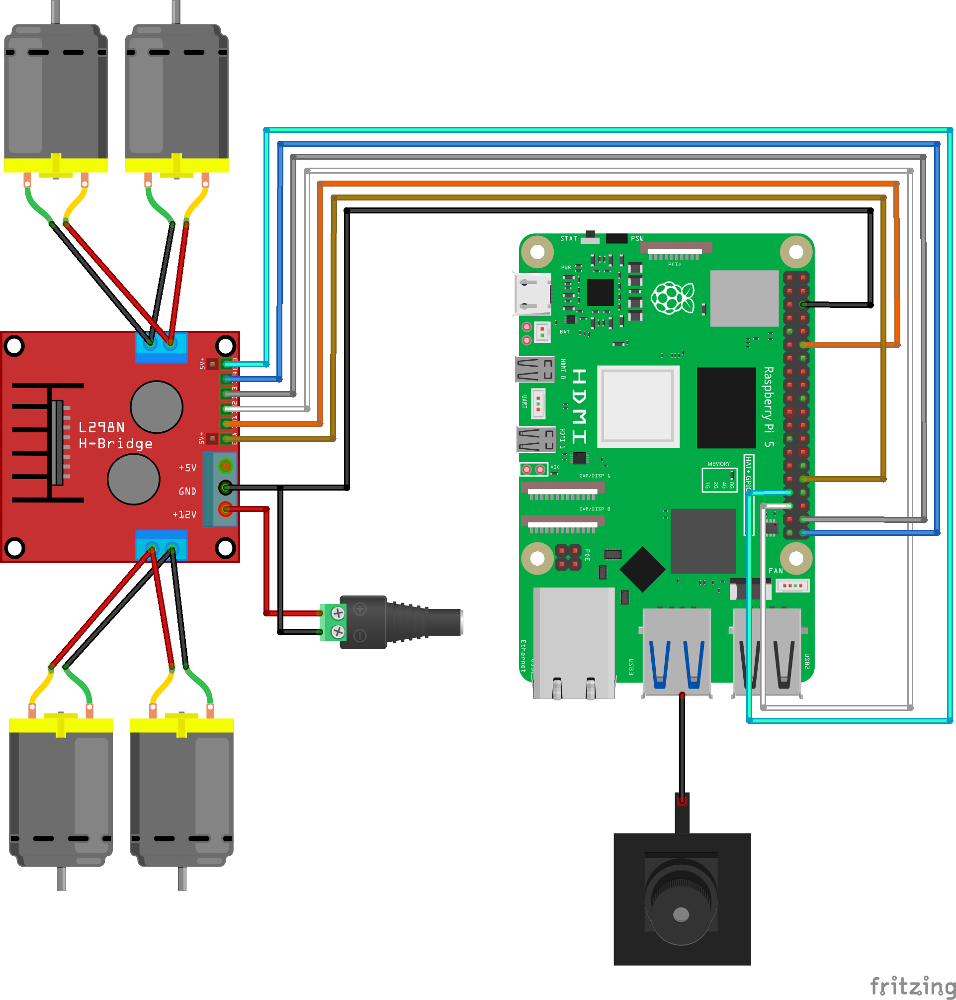

# FiqBot - Autonomous Raspberry Pi 5 Robot Platform


**FiqBot** is a high-performance, modular robotics framework designed specifically for the **Raspberry Pi 5**. It leverages modern libraries like `gpiozero` with `lgpio` backend for efficient hardware control and integrates advanced computer vision models (YOLOv11 via ONNX, MediaPipe) for autonomous navigation and interaction.

This project is built to be a robust starting point for anyone looking to explore edge AI robotics, offering immediate capabilities for person following, gesture recognition, and low-latency remote control.

---

## 📑 Table of Contents

- [✨ Key Features](#-key-features)
- [🛠 Hardware Architecture](#-hardware-architecture)
- [🔌 Wiring & Pinout](#-wiring--pinout)
- [🚀 Installation Guide](#-installation-guide)
- [💻 Usage & Modules](#-usage--modules)
- [🧠 AI Capabilities](#-ai-capabilities)
- [📂 Project Structure](#-project-structure)
- [🔧 Troubleshooting](#-troubleshooting)
- [📜 License](#-license)

---

## ✨ Key Features

- **⚡ Raspberry Pi 5 Optimized**: Built from the ground up to use the new RP1 chip features via `lgpio`, avoiding legacy GPIO library issues.
- **👁️ Computer Vision Pipeline**:
  - **Person Following**: Real-time tracking using **YOLOv11n** (Nano) optimized for edge devices.
  - **Gesture Lock**: Secure target acquisition using Hand Gestures (Open Hand to lock, Fist to unlock) powered by MediaPipe.
- **🎮 Low-Latency Control**:
  - **Web Interface**: Smartphone-friendly controls with live MJPEG streaming via `ustreamer`.
  - **Terminal Remote**: Direct SSH keyboard control for debugging and testing.
- **🏗️ Robust Architecture**: Threaded camera handling, modular script design, and crash-resilient motor safety features (watchdogs).

---

## 🛠 Hardware Architecture

The system assumes a 2WD or 4WD differential drive chassis configuration.

| Component | Specification / Recommendation |
| :--- | :--- |
| **Compute Module** | **Raspberry Pi 5** (4GB or 8GB recommended) |
| **Motor Driver** | **L298N** Dual H-Bridge Module |
| **Motors** | 4x TT Gear Motors (Yellow) or High-torque DC Motors |
| **Power Source** | 2S Li-ion (7.4V) or 3S Li-ion (11.1V) with buck converter for Pi |
| **Camera** | USB Webcam (Logitech C920/C270) or Pi Camera Module 3 |
| **Chassis** | Generic 4WD Robot Car Chassis Kit |

---

## 🔌 Wiring & Pinout

Physical connections should be made according to the diagram below. The code uses **BCM numbering**.

> **⚠️ CRITICAL WARNING**: Always connect the **GND** of the L298N driver to a ground pin on the Raspberry Pi. Failure to do so will result in erratic motor behavior or hardware damage.

### Pin Mapping Table

| L298N Interface | Raspberry Pi Pin (BCM) | Function |
| :---: | :---: | :--- |
| **IN1** | `GPIO 18` | Left Motors Forward |
| **IN2** | `GPIO 19` | Left Motors Backward |
| **IN3** | `GPIO 20` | Right Motors Forward |
| **IN4** | `GPIO 21` | Right Motors Backward |
| **ENA** | `GPIO 12` | Left Speed Control (PWM) |
| **ENB** | `GPIO 13` | Right Speed Control (PWM) |

### Wiring Diagram


---

## 🚀 Installation Guide

### 1. System Preparation
Ensure your Raspberry Pi 5 runs the latest Raspberry Pi OS (Bookworm).
```bash
sudo apt update && sudo apt upgrade -y
sudo apt install -y python3-opencv libopencv-dev git
```

### 2. Clone Repository
```bash
git clone https://github.com/fiqgant/fiqbot.git
cd fiqbot
```

### 3. Install Python Dependencies
It is recommended to run this within a virtual environment (optional but best practice).
```bash
# Create virtual environment (optional)
python3 -m venv venv
source venv/bin/activate

# Install requirements
pip install -r requirements.txt
```

### 4. Setup Camera Streaming (Optional)
For the web-based remote control, install `ustreamer` for superior MJPEG performance compared to Python-based streamers.
```bash
sudo apt install ustreamer
# Start the stream service (background)
ustreamer --host=0.0.0.0 --port=8080 -r 640x480 -f 30 &
```

### 5. AI Model Setup
The system requires the **YOLOv11 Nano (ONNX)** model.
1. Download `yolo11n.onnx`.
2. Place it in the **root** folder `fiqbot/` OR inside `fiqbot/scripts/`.
3. The code handles detection automatically in both locations.

---

## 💻 Usage & Modules

All execution scripts are located in the `scripts/` directory.

### 🧪 Hardware Diagnostics
Run this first to verify your wiring. Motors should spin forward, then backward.
```bash
python scripts/l298n_test.py
```

### 🎮 Terminal Remote Control
Control the robot directly via SSH. Ideally used for latency testing.
```bash
python scripts/l298n_control.py
```
> **Controls**: `W`, `A`, `S`, `D` to move. `SPACE` to stop. `Q` to quit.

### 🌐 Web Command Center
Launches a Flask server to control the robot from any browser on the same network.
```bash
python scripts/l298n_cam_stream.py
```
> **Access**: Open `http://<your-pi-ip>:8000` on your phone or PC.

---

## 🧠 AI Capabilities

### 👤 Autonomous Person Follower
Uses YOLOv11 to detect persons and adjust motor speed/direction to keep the subject centered and at a specific distance.
```bash
python scripts/l298n_yolo.py
```

### 🔒 Gesture & Lock Tracking
An advanced mode that waits for a specific hand gesture to "lock" onto a target.
- **Gesture**: Show an **OPEN HAND** ✋ to lock onto the nearest person.
- **Tracking**: The robot follows *only* that specific person using IoU tracking.
- **Unlock**: Show a **FIST** ✊ to unlock and stop.

```bash
python scripts/l298n_lock.py
```

---

## 📂 Project Structure

```plaintext
fiqbot/
├── assets/               # Wiring diagrams, images, and Fritzing files
│   ├── wiring_l298n.png
│   └── wiring_l298n.fzz
├── scripts/              # Core Logic / Source Code
│   ├── l298n_cam_stream.py    # Web interface backend
│   ├── l298n_control.py       # SSH remote control
│   ├── l298n_lock.py          # Gesture + Tracking logic
│   ├── l298n_test.py          # Motor diagnostic tool
│   └── l298n_yolo.py          # Standard Person Following
├── README.md             # Project Documentation
├── LICENSE               # MIT License
└── requirements.txt      # Python package requirements
```

---

## 🔧 Troubleshooting

### Common Issues

| Issue | Possible Cause | Solution |
| :--- | :--- | :--- |
| **Motors do not move** | Low Battery | Ensure battery is charged (>7V). |
| | No Common Ground | **Connect L298N GND to Pi GND.** |
| **"GPIO Error"** | Wrong Pin Factory | Ensure `lgpio` is installed on Pi 5. |
| **Model Not Found** | Missing ONNX file | Place `yolo11n.onnx` in `scripts/` or root. |
| **Camera Error** | Wrong Index | Edit `CAM_INDEX` in script (try 0, 1, or -1). |

### Debugging
If you encounter permission errors accessing GPIO, ensure your user is in the `gpio` group:
```bash
sudo usermod -a -G gpio $USER
```
Reboot after applying this change.

---

## 📜 License

This project is open-source and licensed under the **MIT License**.
See the [LICENSE](LICENSE) file for more details.

---

Copyright © 2026 **Fiq**. All rights reserved.
