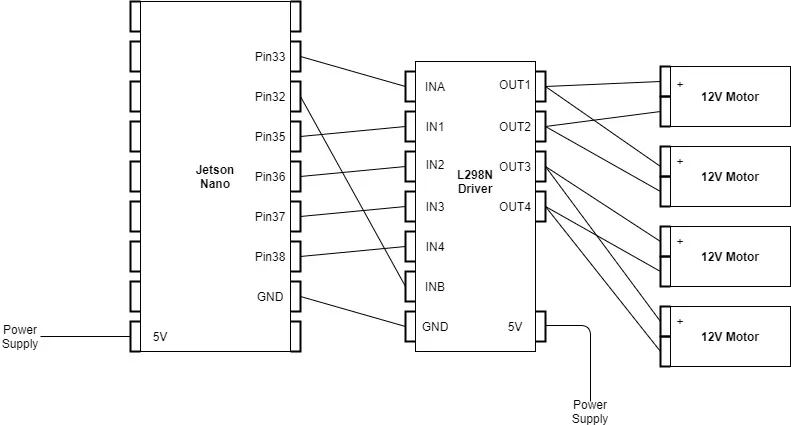

# JetBot Gesture Controller

JetBot project with hand gesture control using CSI camera IMX219 and L298N motor driver with PWM.

## Hardware Requirements

- NVIDIA Jetson Nano with JetPack installed
- L298N Motor Driver
- 2-wheel chassis car
- CSI Camera IMX219
- 2A power bank for Jetson Nano
- 1500mAh Lithium ion battery for motor
- WiFi adapter (optional, for remote access)

## Hardware Connections

### Motor Driver (L298N) to Jetson Nano:
- **Pin 32**: ENA (Left motor PWM)
- **Pin 33**: ENAB (Right motor PWM)
- **Pin 35**: EN1
- **Pin 36**: EN2
- **Pin 37**: EN3
- **Pin 38**: EN4




### Camera:
- Connect CSI camera IMX219 to CSI port on Jetson Nano

## Installation

1. **Install dependencies:**
```bash
sudo pip3 install -r requirements.txt
sudo pip3 install Jetson.GPIO
```

2. **Install jetbot package:**
```bash
cd /path/to/fiqbot
sudo pip3 install -e .
```

3. **Enable PWM pins (must be run every time Jetson boots):**
```bash
# Enable Pin 32 / PWM0
sudo busybox devmem 0x700031fc 32 0x45
sudo busybox devmem 0x6000d504 32 0x2

# Enable Pin 33 / PWM2
sudo busybox devmem 0x70003248 32 0x46
sudo busybox devmem 0x6000d100 32 0x00
```

Or add to `/etc/rc.local` for auto-enable on boot.

## Usage

### Running Hand Gesture Controller (Recommended):

```bash
sudo python3 hand_gesture.py
```

**Note:** This script requires `sudo` to access GPIO pins.

### Hand Gesture Controls:
- **Open Palm**: Robot follows your hand position (moves left/right/forward/backward)
- **Closed Fist**: Robot stops immediately
- Press `q` to quit
- Robot will stop if no hand is detected for 1.5 seconds

### Running Face Follower (Alternative):

```bash
sudo python3 face_follow.py
```

### Face Follower Controls:
- Press `q` to quit
- Robot will automatically follow detected faces
- Robot will stop if no face is detected for 2 seconds

## Configuration

### Hand Gesture Controller (`hand_gesture.py`):

You can modify control parameters in `hand_gesture.py`:

- `dead_zone_x`: Horizontal dead zone (pixels) - robot won't move if hand is within this zone
- `dead_zone_y`: Vertical dead zone (pixels)
- `max_speed`: Maximum motor speed (0.0 - 1.0)
- `min_speed`: Minimum speed to start moving
- `kp_x`: Proportional gain for horizontal control
- `kp_y`: Proportional gain for vertical control
- `hand_timeout`: Time (seconds) before robot stops if no hand detected

### Face Follower (`face_follow.py`):

You can modify control parameters in `face_follow.py`:

- `dead_zone_x`: Horizontal dead zone (pixels) - robot won't move if face is within this zone
- `dead_zone_y`: Vertical dead zone (pixels)
- `max_speed`: Maximum motor speed (0.0 - 1.0)
- `min_speed`: Minimum speed to start moving
- `kp_x`: Proportional gain for horizontal control
- `kp_y`: Proportional gain for vertical control
- `face_timeout`: Time (seconds) before robot stops if no face detected

## Troubleshooting

1. **Robot not moving:**
   - Make sure PWM pins are enabled (run enable PWM command)
   - Verify hardware connections are correct
   - Make sure script is run with `sudo`

2. **Camera not detected:**
   - Make sure CSI camera is connected properly
   - Check if camera is detected: `ls /dev/video*`
   - If using jetcam, make sure it's installed

3. **Hand gesture detection not working:**
   - Ensure adequate lighting
   - Make sure your hand is clearly visible to the camera
   - Keep hand open (all fingers extended) for following mode
   - Make a closed fist to stop the robot
   - Try adjusting detection confidence in `hand_gesture.py`

4. **Face detection not working (face_follow.py):**
   - Ensure adequate lighting
   - Make sure face is facing the camera
   - Try adjusting `minNeighbors` and `minSize` parameters in `detect_face()`

## File Structure

```
fiqbot/
├── setup.py              # Setup script to install package
├── requirements.txt      # Python dependencies
├── hand_gesture.py       # Main script for hand gesture control (recommended)
├── face_follow.py        # Alternative script for face following
├── enable_pwm.sh         # Script to enable PWM pins
├── README.md            # This documentation
└── jetbot/
    ├── __init__.py
    ├── robot.py         # Robot control with L298N
    └── camera.py        # Camera wrapper for CSI IMX219
```

## References

This project is based on:
- [NVIDIA JetBot Project](https://github.com/NVIDIA-AI-IOT/jetbot)
- L298N PWM Motor Driver setup for Jetson Nano

## License

Open source - feel free to modify and contribute!

